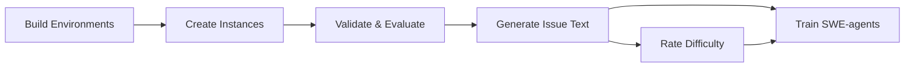

# Tutorials

Build unlimited training data and train state-of-the-art SWE-agents. This guide covers the complete workflow: from environment setup to model training and evaluation.

---

## 📋 Prerequisites

!!! info "System Requirements"
    **Required:** Docker
    **Tested on:** Ubuntu 22.04.4 LTS
    **Not supported:** Windows, macOS

New to SWE-smith? Start with [Installation](../getting_started/installation.md) and [Quickstart](../getting_started/quickstart.md).

---

## 🎯 Quick Navigation

-   :material-docker: **Build Environments**

    ---

    Create reproducible Docker images for any repository. Capture dependencies, build containers, and validate with automated testing.

    [:octicons-arrow-right-24: Get started](env_construction.md)

-   :material-bug: **Create Instances**

    ---

    Generate task instances using LM prompts, procedural modifications, PR mirroring, or combined techniques. Scale to thousands of bugs.

    [:octicons-arrow-right-24: Generate bugs](create_instances.md)

-   :material-check-circle: **Validate & Evaluate**

    ---

    Filter candidates that break tests and verify proposed solutions. Built-in harnesses for validation and evaluation workflows.

    [:octicons-arrow-right-24: Run harnesses](harnesses.md)

-   :material-file-document: **Generate Issue Text**

    ---

    Add natural language problem statements to task instances using LM generation or alternative methods.

    [:octicons-arrow-right-24: Create issues](issue_gen.md)

-   :material-speedometer: **Rate Difficulty** · Optional

    ---

    Classify tasks as easy/medium/hard using a fine-tuned Qwen 2.5 Coder model. Compare against SWE-bench benchmarks.

    [:octicons-arrow-right-24: Assess difficulty](difficulty_rating.md)

-   :material-school: **Train SWE-agents**

    ---

    Complete RSFT pipeline: generate trajectories, filter successful solutions, fine-tune models, and evaluate on SWE-bench.

    [:octicons-arrow-right-24: Start training](train_swe_agent.md)

---

##  Recommended Workflow

1. **Build Environments** → Set up Docker images
2. **Create Instances** → Generate synthetic bugs
3. **Validate & Evaluate** → Filter valid task instances
4. **Generate Issue Text** → Add problem descriptions
5. **Rate Difficulty** *(optional)* → Classify task complexity
6. **Train SWE-agents** → Fine-tune models with RSFT
